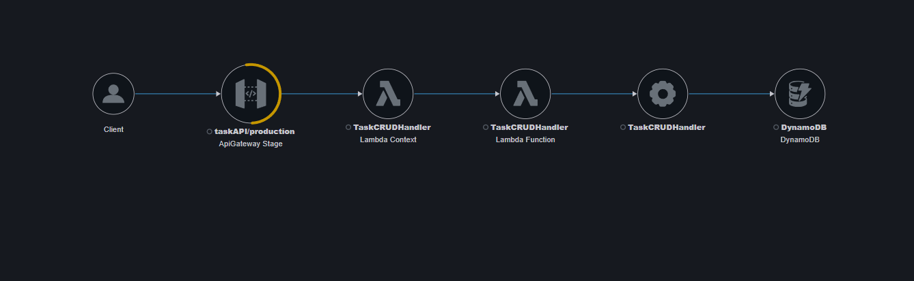

# Serverless Task CRUD API on AWS 

A small serverless REST API for creating and managing tasks, built by hand in the AWS console as my first barebones AWS project. Following a youtube video step by step but adding in my own twists and images. Requests flow from API Gateway to a Lambda function, which reads and writes tasks in DynamoDB.

## Architecture



```
Client -> API Gateway (REST API, "production" stage) -> Lambda (TaskCRUDHandler) -> DynamoDB
                                                              |
                                                       CloudWatch Logs + X-Ray
```

| Service | Role |
|---|---|
| API Gateway (REST API) | Public HTTPS endpoint, routes requests to Lambda |
| Lambda (`TaskCRUDHandler`) | Business logic for the CRUD operations |
| DynamoDB | Stores tasks, keyed by `id` |
| CloudWatch Logs | Lambda execution logs |
| X-Ray | Request tracing and the service map above |

## API reference

Resource: `/task` (note: singular)

| Method | Purpose |
|---|---|
| POST | Create a task |
| GET | List tasks |
| PATCH | Update a task |
| DELETE | Delete a task |
| OPTIONS | CORS preflight (mock integration) |

Example request:

```
POST https://YOUR-API-URL/production/task
Content-Type: application/json

{"title": "test"}
```

Response: `200 {"message":"Task created successfully"}`

## How I tested it

I wrote a short Python script with the `requests` library and checked results in the terminal, CloudWatch Logs, and the X-Ray trace map.

```python
import requests

url = "https://YOUR-API-URL/production/task"

r = requests.post(url, json={"title": "test"})
print(r.status_code, r.text)

r = requests.get(url)
print(r.status_code, r.text)
```

## Errors I hit and how I fixed them

### 1. `403 {"message":"Missing Authentication Token"}`
- **Symptom:** Both POST and GET returned 403 even though the API was deployed.
- **Cause:** I called `/tasks`, but my resource is `/task`. API Gateway returns this message when no route matches, even when no authentication is configured, so the wording is misleading.
- **Fix:** Checked the exact path under API Gateway > Resources and corrected the URL.
- **Lesson:** "Missing Authentication Token" usually means a wrong path or method, not an auth problem. Verify the route first. Remember to click **Deploy API** after changing routes on a REST API.

### 2. Confusing the Lambda ARN with the API URL
- **Symptom:** I tried to use `arn:aws:lambda:...:function:TaskCRUDHandler` as the API address.
- **Cause:** An ARN identifies a resource inside AWS and isn't callable over HTTPS.
- **Fix:** Used the **Invoke URL** from API Gateway > Stages (`https://<id>.execute-api.<region>.amazonaws.com/<stage>`) and appended the route.

### 3. X-Ray trace map showed "No services"
- **Symptom:** The trace map was empty right after enabling tracing.
- **Cause:** No traced traffic had reached the API yet, and the default time window was only 5 minutes. My early requests also failed at API Gateway (error 1), so they never reached Lambda.
- **Fix:** Turned on **Active tracing** for the Lambda, sent successful requests, widened the range to 1 hour, and refreshed.
- **Lesson:** Tracing only shows traffic that happens after it's enabled. The yellow ring on the API Gateway node in my map comes from those earlier 403 responses.

### 4. No way to run `.http` requests in PyCharm
- **Symptom:** No run button appeared in my `.http` file.
- **Cause:** PyCharm's built-in HTTP Client is a Professional-edition feature, and I was using Community.
- **Fix:** Sent requests from a Python script using `requests` instead.

### 5. Open issue: GET returns only the `id`
- **Symptom:** `GET /task` returns `[{"id": "..."}]` without the `title` I posted.
- **Status:** Still to investigate. Likely the handler's GET response or how the item is saved. I plan to check the Lambda code and the item in the DynamoDB console.

## What I learned

- How API Gateway, Lambda, and DynamoDB fit together in a serverless design
- How to use CloudWatch Logs and X-Ray to confirm what actually ran
- Reading error messages critically: the message doesn't always describe the real cause

## Cleanup

When finished, I delete the API Gateway API, the Lambda function, its CloudWatch log group, and the DynamoDB table so nothing keeps running.

## Next steps

- Fix the GET response so it returns full task details
- Write an OpenAPI spec for the API
- Rebuild the same stack with Terraform
- Add input validation and error responses to the Lambda handler
